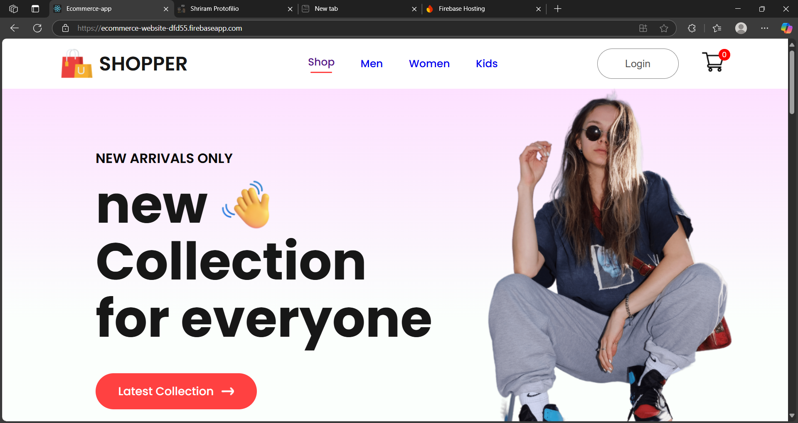

# E-Commerce React App

 <!-- Replace with actual screenshot -->

A modern e-commerce web application built with React, Firebase, and React Router. Features product listings, cart functionality, and responsive design.

## 🔥 Live Demo

**[View Live Site](https://ecommerce-website-dfd55.firebaseapp.com/)**

## 🛠 Tech Stack

- **Frontend**: React.js, React Router, Context API
- **Styling**: CSS Modules
- **Backend**: Firebase (Hosting, Firestore, Authentication)
- **Deployment**: Firebase Hosting

## 🚀 Getting Started

### Prerequisites
- npm (v8+)
- Firebase account

### Installation
1. Clone the repository:
   ```bash
   git clone https://github.com/ramtechnow/Ecommerce_webpage.git
